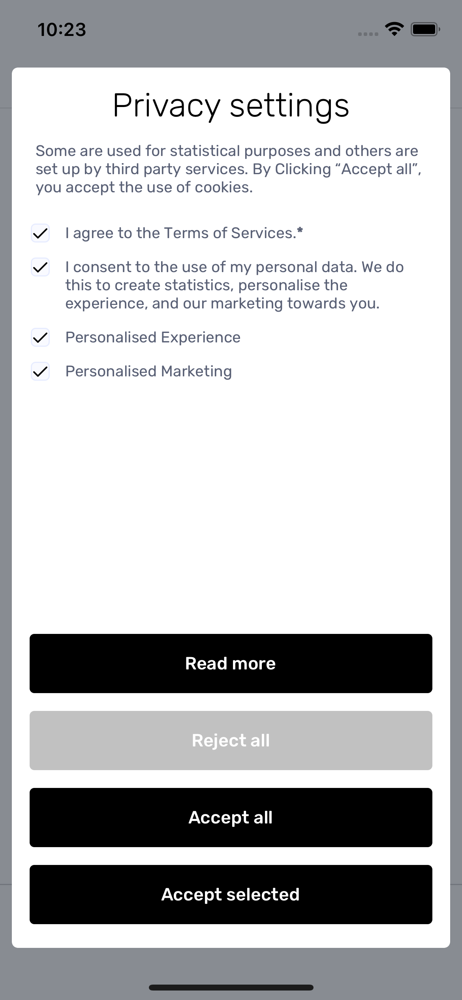
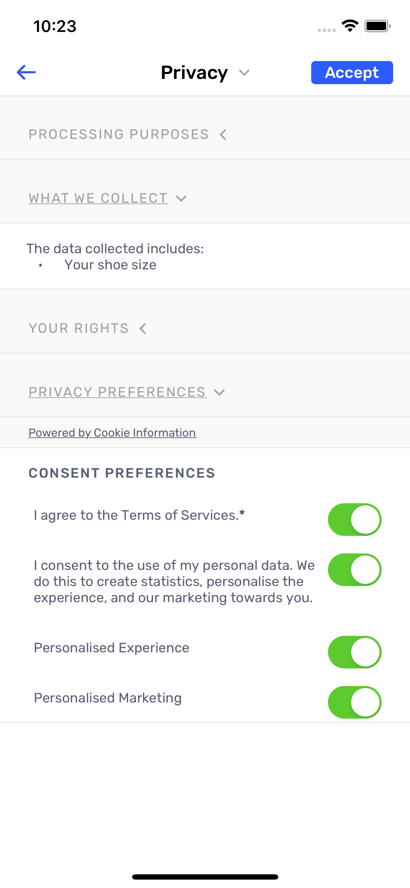



# Mobile Consents SDK

# Installation
MobileConsentsSDK is available through [CocoaPods](https://cocoapods.org). To install it, simply add the following line to your Podfile:
```ruby
pod 'MobileConsentsSDK'
```
Then run `pod install`.

# Using the SDK

## Initializing

```swift 
import MobileConsentsSDK

let serverURL = URL(string: "{address_of_the_server_to_send_consent}")!
let mobileConsentsSDK = MobileConsents(withBaseURL: serverURL)
```
## Getting Consent Solution

```swift 
mobileConsentsSDK.fetchConsentSolution(forUniversalConsentSolutionId: "consent solution identifier", completion: { result in
	switch result {
	case .success(let consentSolution):
	  /* here you can make use of fetched ConsentSolution object */
	case .failure(let error):
	  /* here you can handle error from fetching te content solution */
	}
}) 

/* ConsentSolution object structure */

struct  ConsentSolution {
  let  id: String
  let  versionId: String
  let  consentItems: [ConsentItem]
}

struct  ConsentItem {
  let  id: String
  let  translations: [ConsentTranslation]
}

struct  ConsentTranslation {
  let  language: String
  let  shortText: String
  let  longText: String
}
```

## Sending Consent to server
If you want to send consent to the server, first you have to create `Consent` object which structure looks like this:
```swift
var consent = Consent(consentSolutionId: "consentSolution.id", consentSolutionVersionId: "consentSolution.versionId")

/* if you want your consent to have a custom data you can add it as a last parametr */
let customData = ["email": "test@test.com", "device_id": "test_device_id"]
var consent = Consent(consentSolutionId: "consentSolution.id", consentSolutionVersionId: "consentSolution.versionId" customData: customData)

```
Then you have to add processing purposes which contains a given consents

```swift
/* given consents are included in main consent object as ProcessingPurpose objects which you can add to Consent object using `addProcessingPurpose` function */

let purpose = ProcessingPurpose(consentItemId: "consentItem.id", consentGiven: {true / false}, language: "en")
consent.addProcessingPurpose(purpose)

```
After setting up the Consent object you are ready to send it to the server
```swift
mobileConsentsSDK.postConsent(consent) { error in
  /* if error is nil it means that post succeeded */
}
```

## Getting locally saved consents data
```swift
let savedData:[SavedConsent] = mobileConsentsSDK.getSavedConsents()
```
SavedConsent object structure
```swift
struct  SavedConsent {
  let  consentItemId: String
  let  consentGiven: Bool
}
```

## Canceling last post to server request
```swift
mobileConsentsSDK.cancel()
```

# Using built-in mobile consents UI

SDK contains built-in screens for managing consents.
By default, built-in UI tries to use application's current langauge for consent translations.
If application's language is not available in translations, English will be used.

## Privacy Pop-Up



To show Privacy Pop Up screen, use `showPrivacyPopUp` method:

```swift
mobileConsentsSDK.showPrivacyPopUp(forUniversalConsentSolutionId: "consent solution identifier")
```

By default, pop up is presented by top view controller of key window of the application.
To change that, you can pass presenting view controller as an optional parameter:

```swift
mobileConsentsSDK.showPrivacyPopUp(
  forUniversalConsentSolutionId: "consent solution identifier",
  onViewController: someViewController
)
```

## Privacy Center



To show Privacy Center screen, use `showPrivacyCenter` method:

```swift
mobileConsentsSDK.showPrivacyCenter(forUniversalConsentSolutionId: "consent solution identifier")
```

By default, privacy center is presented by top view controller of key window of the application.
To change that, you can pass presenting view controller as an optional parameter:

```swift
mobileConsentsSDK.showPrivacyCenter(
  forUniversalConsentSolutionId: "consent solution identifier",
  onViewController: someViewController
)
```

## UI language

By default, Privacy Pop-up and Privacy Center use application's current langauge for consent translations. If application's language is not available in consent translations, English is used.

You can override langauge used by the screens by initializing SDK with custom langauge code:

```swift
import MobileConsentsSDK

let serverURL = URL(string: "{address_of_the_server_to_send_consent}")!
let mobileConsentsSDK = MobileConsents(withBaseURL: serverURL, uiLanguageCode: "DE")
```